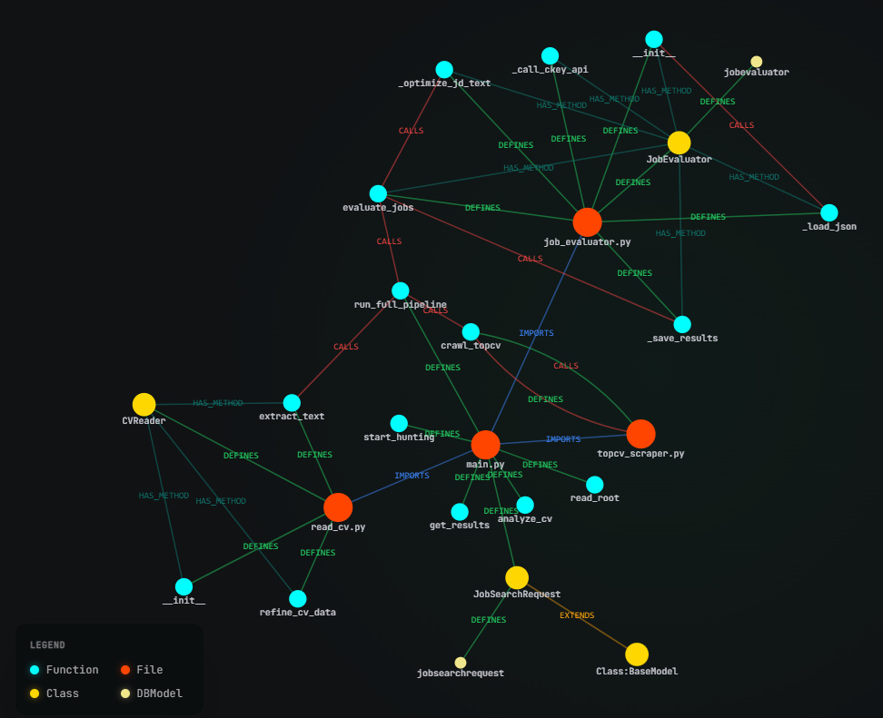

# 🚀 AI Job Hunter (One-Click)

AI Job Hunter là một Hệ thống Đại lý AI (AI Agent) tự động hóa hoàn toàn quy trình tìm kiếm và ứng tuyển việc làm. Chỉ với một cú click chuột và file CV của bạn, hệ thống sẽ tự động phân tích kỹ năng, tìm kiếm các công việc phù hợp nhất trên TopCV, và dùng AI để chấm điểm mức độ khớp của bạn với từng bản mô tả công việc (JD).

## ✨ Tính năng nổi bật

* **🧠 Tự động đọc CV (Smart CV Parsing):** Trích xuất thông tin, số năm kinh nghiệm và tự động kết luận "Chức danh mục tiêu" (Target Job Title) từ file PDF.
* **🕷️ Web Scraping thông minh:** Tự động cào dữ liệu các công việc mới nhất từ TopCV. Được tích hợp cơ chế mô phỏng người dùng thật (User-Agent, Slow-mo) để vượt qua các hệ thống Anti-Bot/Cloudflare.
* **📊 Chấm điểm bằng AI (AI Evaluation):** Sử dụng model `gemini-2.5-flash` để đối chiếu CV với JD, đưa ra thang điểm (0-100), phân tích Điểm mạnh (Pros), Điểm yếu (Cons) và Lời khuyên ứng tuyển.
* **🎮 Trải nghiệm người dùng:** Tích hợp Mini-game (Flappy Bird) giúp người dùng giải trí trong lúc chờ AI xử lý dữ liệu. Cơ chế Polling kết quả mượt mà.

## 🏗️ Kiến trúc Dự án (Core Structure)

Dưới đây là sơ đồ trực quan về cách các file, lớp (class), và phương thức (function) trong hệ thống tương tác với nhau để hoàn thành quy trình 'One-Click':



*(Sơ đồ minh họa luồng từ khi tải CV lên, trích xuất dữ liệu, tìm kiếm job, cho đến khi AI chấm điểm xong và trả kết quả.)*

## 🛠️ Công nghệ sử dụng

* **Backend:** Python, FastAPI, Uvicorn
* **Web Scraping:** Playwright
* **AI & NLP:** Gemini 2.5 Flash (via ckey.vn API), PyMuPDF (đọc PDF)
* **Frontend:** HTML5, JavaScript (Vanilla), Tailwind CSS

## ⚙️ Hướng dẫn cài đặt

1. **Yêu cầu hệ thống:** Có cài đặt sẵn Python 3.8+
2. **Cài đặt các thư viện cần thiết:**
   Mở terminal và chạy lệnh sau:
   ```bash
   pip install fastapi uvicorn playwright pymupdf requests python-multipart pydantic

3. **Cài đặt trình duyệt cho Playwright:
   ```bash
   playwright install chromium

4. **Chuẩn bị API Key: Nhận API Key từ nền tảng ckey.vn (hoặc API Key tương tự, trong project mình đang dùng model của gemini, mọi người có thể sửa lại trong file main.py nhé!)

## 🚀 Cách chạy chương trình

1. **Khởi động Backend Server (tại thư mục gốc của dự án):
   ```bash
   uvicorn main:app --reload

2. **Mở file index.html bằng trình duyệt web bất kỳ.
3. Tải lên file CV (định dạng PDF), nhập API Key, chọn số lượng Job và bấm Bắt đầu săn việc.
